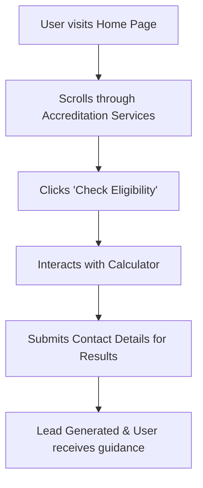

## 1. Product Overview
This is a new website for a client's business that helps individuals and companies gain and maintain UK accreditations.
- It aims to attract new clients, generate leads, and provide a premium, engaging experience that builds trust and authority.
- The target value is to simplify the complex accreditation process, offering clear guidance and interactive tools (like eligibility calculators) to convert visitors into clients.

## 2. Core Features

### 2.1 User Roles
| Role | Registration Method | Core Permissions |
|------|---------------------|------------------|
| Visitor | None | Browse public pages, use calculators, read guides, and submit lead forms |
| Admin (Future) | Invite | Manage content, view leads, update accreditation criteria |

### 2.2 Feature Module
1. **Landing Page**: Hero section with clear CTA, "Blue glowing" effects, interactive accreditation timeline, and lead generation form.
2. **Accreditation Guides/Content**: Information-dense, structured guides for different UK accreditations.
3. **Interactive Tools**: An engaging eligibility calculator to capture leads.
4. **Dashboard/Progress Tracking (Demo)**: A visual representation of the accreditation process using interactive charts.

### 2.3 Page Details
| Page Name | Module Name | Feature description |
|-----------|-------------|---------------------|
| Home | Hero Section | High-end typography, smooth entry animations, glassmorphism elements, and primary CTA. |
| Home | Services/Timeline | Linear-style compact cards showing steps to gain accreditations with hover glowing effects. |
| Calculator | Lead Magnet | Interactive step-by-step eligibility calculator with smooth Framer Motion transitions. |
| About/Contact | Lead Form | Minimalist contact form with instant validation and a professional, native feel. |

## 3. Core Process
The primary flow is designed to educate the user and convert them into a lead via the calculator or contact form.

## 4. User Interface Design
### 4.1 Design Style
- **Aesthetic**: Premium startup SaaS (Stripe/Linear style). Minimalist, productivity-focused, and information-dense.
- **Color Theme**: Deep dark or crisp white background with "blue glowing" effects, soft gradients, and glassmorphism elements.
- **Typography**: High-end distinctive display fonts paired with clean, readable sans-serif body fonts.
- **Shapes & Layout**: Rounded corners (2xl), tasteful depth/separation, compact and structured grid layouts.
- **Motion**: Smooth, native-feeling transitions using Framer Motion. Micro-interactions on hover.

### 4.2 Page Design Overview
| Page Name | Module Name | UI Elements |
|-----------|-------------|-------------|
| Home | Hero | Large distinctive typography, subtle blue gradient mesh background, glassmorphic CTA buttons. |
| Home | Features | Grid layout, compact cards with 2xl rounded corners, subtle border glows on hover. |
| Calculator | Interactive Form | Progress bar, sleek form inputs, fluid height animations between steps. |

### 4.3 Responsiveness
Desktop-first design approach with seamless mobile adaptation, ensuring touch targets are optimized for mobile devices while maintaining the premium feel.
