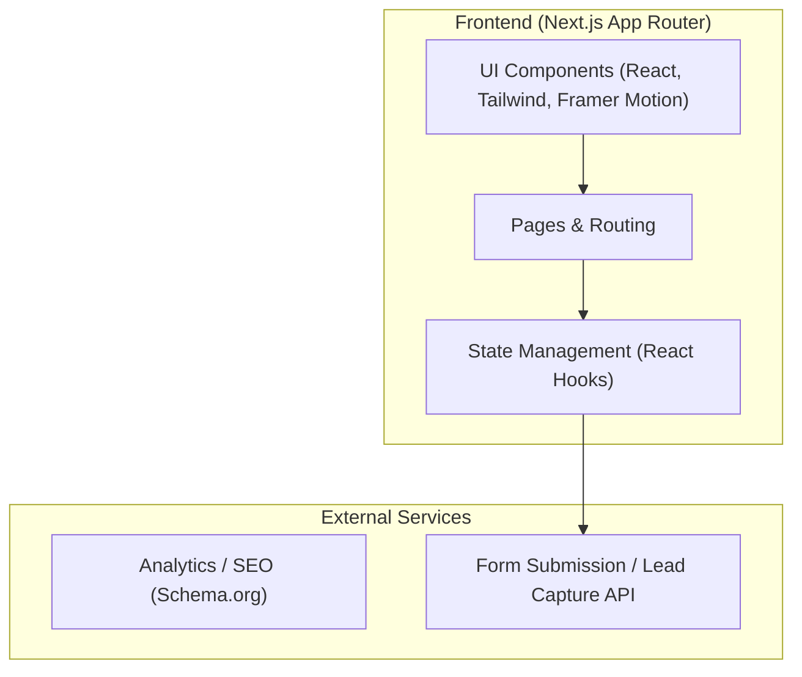

## 1. Architecture Design

## 2. Technology Description
- **Frontend Framework**: Next.js (App Router) for SEO optimization and performance.
- **Styling**: Tailwind CSS for utility-first, minimalist design and rapid styling.
- **Animations**: Framer Motion for smooth, native-feeling transitions and interactive elements.
- **Data Visualization**: Recharts for interactive, color-coded charts (if applicable for progress visualization).
- **Icons**: Lucide React or similar minimalist icon set.
- **Initialization Tool**: `create-next-app`

## 3. Route Definitions
| Route | Purpose |
|-------|---------|
| `/` | Landing page outlining services, value proposition, and timeline. |
| `/calculator` | Interactive lead-magnet calculator for accreditation eligibility. |
| `/guides` | Content-heavy, SEO-optimized pages for specific UK accreditations. |
| `/contact` | Standard contact and inquiry form. |

## 4. API Definitions (Future/Optional)
*Currently relying on Next.js server actions or third-party form providers (e.g., Formspree, Resend) for lead capture.*

| Endpoint | Method | Purpose | Payload |
|----------|--------|---------|---------|
| `/api/leads` | POST | Submit calculator results and user contact info | `{ name: string, email: string, accreditationType: string, score: number }` |

## 5. Development Workflow Constraints
- **Version Control**: Required to push to GitHub after every single command or substantive change to maintain strict evolutionary tracking.
- **Component Structure**: Highly modular, separating interactive client components (`"use client"`) from SEO-friendly server components.
